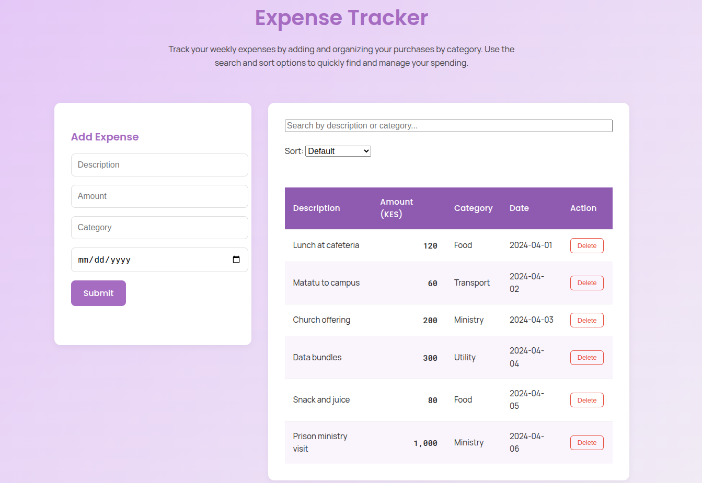

# My Expense Tracker (React)

A modern expense tracking application with intuitive controls and real-time filtering. Perfect for personal finance management.

## Link to My Expense Tracker 
https://expense-tracker-eight-gray.vercel.app/




## Features

### Core Functionality
- **Add Expenses**  
  Form with validation for description, amount (KES), category, and date  
- **Interactive Table**  
  Clean display of all expenses with sorting capabilities  
- **Instant Search**  
  Filter by description or category as you type  
- **One-Click Delete**  
  Remove unwanted entries with confirmation  

### Advanced Features
- **Smart Sorting**  
  Alphabetical sorting by description or category  
- **Responsive Design**  
  Fully functional on mobile, tablet, and desktop  
- **Currency Formatting**  
  Automatic KES formatting with proper thousand separators  

## Tech Stack

| Category       | Technology           |
|----------------|----------------------|
| Framework      | React 18             |
| Bundler        | Vite 4               |
| Styling        | CSS                  |
| ID Generation  | UUID                 |
| Linting        | ESLint               |

## Quick Start

### Prerequisites
- Node.js 
- npm 

### Installation
```bash
# Clone the repository
git clone https://github.com/Chenzie2/expense-tracker.git

# Navigate to project directory
cd expense-tracker

# Install dependencies
npm install

# Start development server
npm run dev
```

### License
For personal use only.

### Contact
**Author**: Grace Zawadi   
- GitHub: [Chenzie2](https://github.com/Chenzie2)
- Project Repository: [Expense Tracker GitHub](https://github.com/Chenzie2/expense-tracker)
